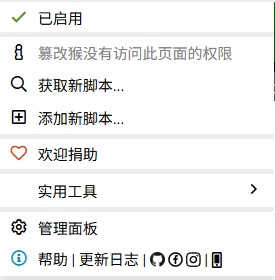
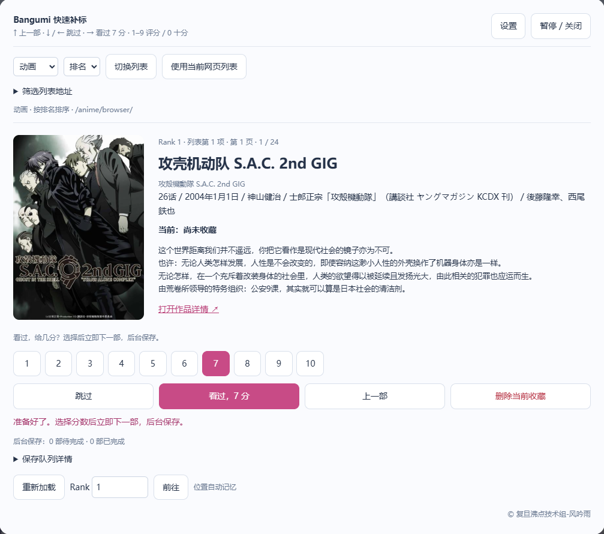
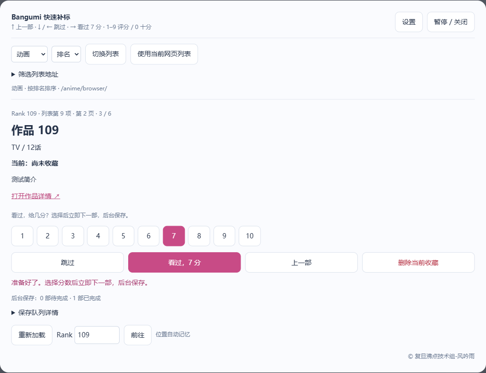
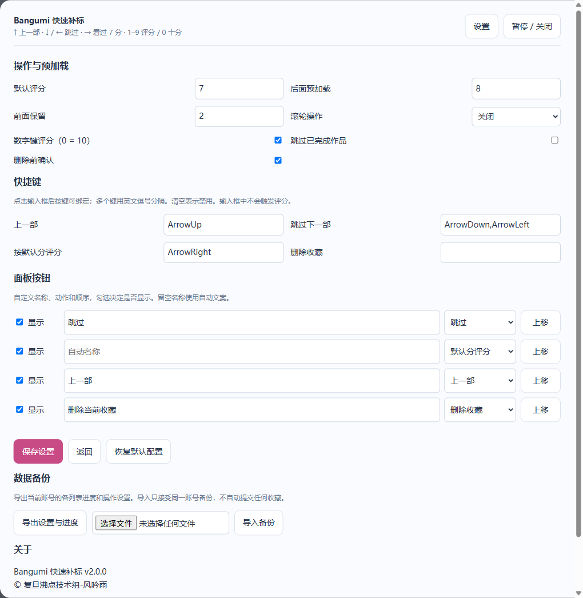

# Bangumi 快速补标

沿列表顺序浏览动画、漫画、书籍、游戏、音乐和三次元作品，用键盘、鼠标按钮或滚轮补全收藏。

## 安装

**推荐：下载脚本 → 油猴导入。无需 Node.js，无需启动服务器。**

### 1. 安装油猴

从 [Tampermonkey 官网](https://www.tampermonkey.net/index.php) 选择自己的浏览器并安装扩展。也支持 Violentmonkey，下面以 Tampermonkey 为例。

安装完成后，点击浏览器右上角的扩展图标，找到 Tampermonkey（篡改猴），进入 **管理面板**。



### 2. 导入脚本

1. **[点击下载 bangumi-quick-mark.user.js](https://github.com/LimitedMouse/bangumi-quick-mark/releases/latest/download/bangumi-quick-mark.user.js)**，保留 `.user.js` 后缀。也可尝试 [直接安装](https://raw.githubusercontent.com/LimitedMouse/bangumi-quick-mark/main/bangumi-quick-mark.user.js)，由管理器接管安装。
2. 在油猴管理面板顶部点击 **实用工具**。
3. 在 **导入 / 从文件导入** 区域点击 **选择文件**，选中刚下载的脚本。
4. 若出现脚本预览或安装确认页，点击 **安装**。
5. 回到 **已安装脚本**，确认 **Bangumi 快速补标** 的开关已开启。

不同版本的管理器文字可能略有差别，关键路径是 **管理面板 → 实用工具 → 从文件导入**。

### 3. 打开 Bangumi

登录 [bgm.tv](https://bgm.tv/)、[bangumi.tv](https://bangumi.tv/) 或 [chii.in](https://chii.in/)，刷新页面，然后点击右下角的 **快速补标**。


打开后即可顺着列表补标，快速填格子，成为老资历。



### 点击脚本链接后只显示源代码？

这不影响安装。用页面的下载按钮或 `Ctrl+S` 保存为 `bangumi-quick-mark.user.js`，再按上面的“从文件导入”操作。不要把文件保存为 `.txt` 或 `.html`。

也可直接复制源码：`Ctrl+A` → `Ctrl+C`，打开油猴的 **添加新脚本**，在编辑区全选替换为复制的内容，按 `Ctrl+S` 保存。

### 安装后看不到按钮？

- 确认管理器和脚本都已启用，并允许扩展访问当前 Bangumi 域名。
- Chrome 打开 `chrome://extensions/`，Edge 打开 `edge://extensions/`，进入 Tampermonkey **详细信息**，开启 **允许运行用户脚本**（如果有）。
- 较旧浏览器没有该开关时，按管理器提示开启扩展页的 **开发者模式**。
- 最后刷新 Bangumi 页面。输入法、广告拦截器或其他脚本有冲突时，可先暂时关闭相关扩展排查。

`npm run serve` 只供开发者预览本地安装页，普通用户不需要运行。

## 默认操作



| 操作 | 行为 |
|---|---|
| ↑ | 上一部，支持跨页 |
| ↓ / ← | 跳过下一部，不改收藏 |
| → | 完成收藏，给默认分并下一部，初始 7 分 |
| 1–9 / 小键盘 | 给对应分数并下一部 |
| 0 / 小键盘 0 | 给 10 分并下一部 |
| 点击分数 | 给指定分数并下一部 |
| 删除当前收藏 | 删除收藏及评分，停留当前作品；默认确认 |
| Esc | 取消确认、返回设置前页面或关闭面板 |

设置可修改默认分数（1–10）、快捷键、按钮名称/动作/顺序/可见性、预加载数量、跳过已完成作品及删除确认。



滚轮默认关闭，可选择直接滚轮或 Alt + 滚轮。向下跳过，向上返回，不会评分。内置惯性抑制，简介区仍正常滚动。输入框、设置面板和输入法组合输入不会评分，长按按键不会连发。

## 列表与位置

支持五类作品的排名、热度、收藏、日期、名称排序；漫画使用书籍漫画子分类。可使用当前分类浏览页或粘贴地址保留筛选。

- 排名排序按具体 **Rank** 跳转；其他排序按 **列表第 N 项** 跳转。
- 每个账号、分类、排序、筛选组合分别记忆位置，自动翻页。
- 重开后恢复上次作品；榜单变动时尝试在相邻页找回作品，否则恢复邻近位置并提示。
- 默认后面预加载 8 部、前面保留 2 部，可在设置中修改。
- 1.x 旧版动画排行榜进度自动迁移。

## 保存、删除和纠错

先记录本地队列，再前进，后台提交网站原生表单并核对结果。评分保留原标签、短评和隐私；删除与网站行为一致，会移除该收藏的评分、标签、短评。

误标后按 ↑ 返回，点击“删除当前收藏”。评分尚未完成时删除也会按序处理，最终采用最后一次操作。可直接重新评分，无需先删除。

面板显示待完成、成功和失败，失败可以重试或放弃。重试先核对网站状态。同域名多个标签页协调写入，避免旧评分覆盖新选择；写入前检查当前账号。

关闭面板继续保存；关闭网页后无法继续请求，下次打开核对并恢复未完成任务。退出前可等待“0 部待完成”。

## 数据管理

正式用户脚本通过管理器存储共享三个支持域名的设置和进度。待提交队列按账号及域名隔离，请在原域名处理未完成队列。调试注入回退到当前域名 localStorage。

不同浏览器/管理器不共享存储；清除脚本数据会丢失进度。设置提供导入导出，只接受同账号备份，不包含登录凭据，不会因导入自动提交收藏。参见 [隐私说明](PRIVACY.md)。

## 开发与发布

需要 Node.js 20+，无 npm 运行依赖。

```text
npm run build     # 构建单个 .user.js
npm run check     # 语法检查
npm run package  # 生成 release/ 发布文件夹
npm run serve    # 本地安装页
```

源码模块：config（配置）、storage（数据迁移）、site（站点与缓存）、queue（队列）、ui（界面）、app（交互）。修改源码后构建，不直接编辑生成脚本。

问题反馈：[GitHub Issues](https://github.com/LimitedMouse/bangumi-quick-mark/issues)。采用 [MIT 许可证](LICENSE)，© 复旦沸点技术组-风吟雨。
